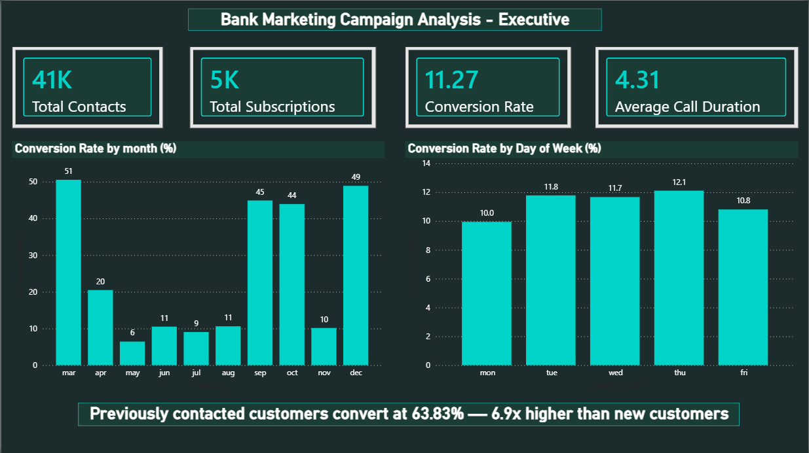
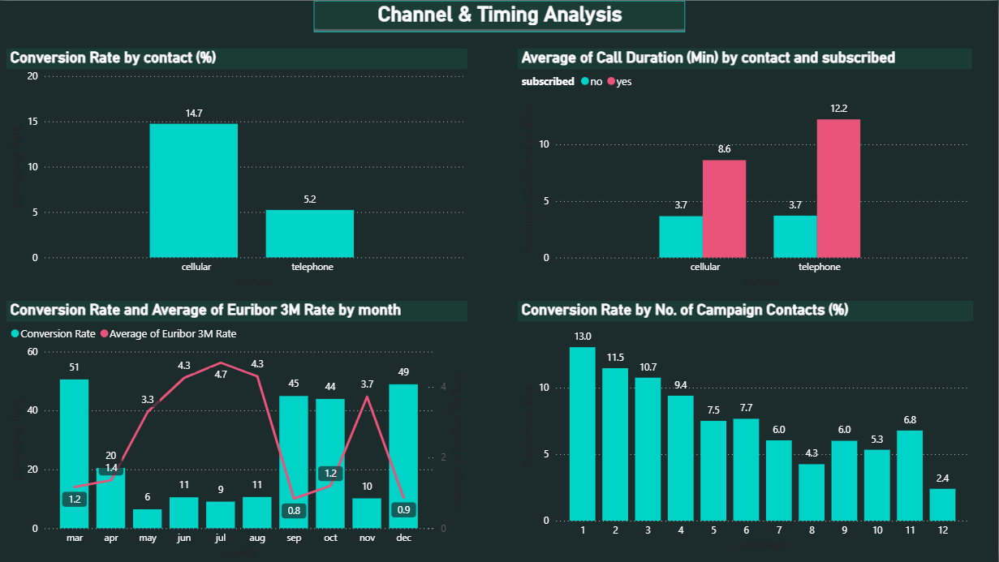
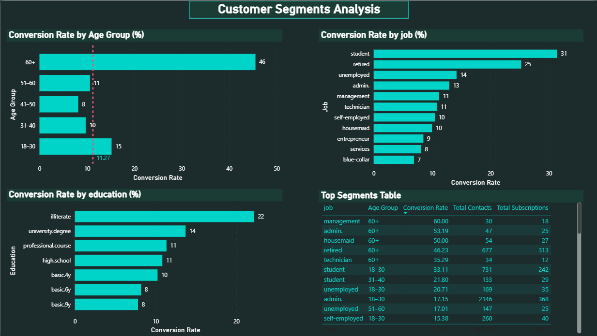
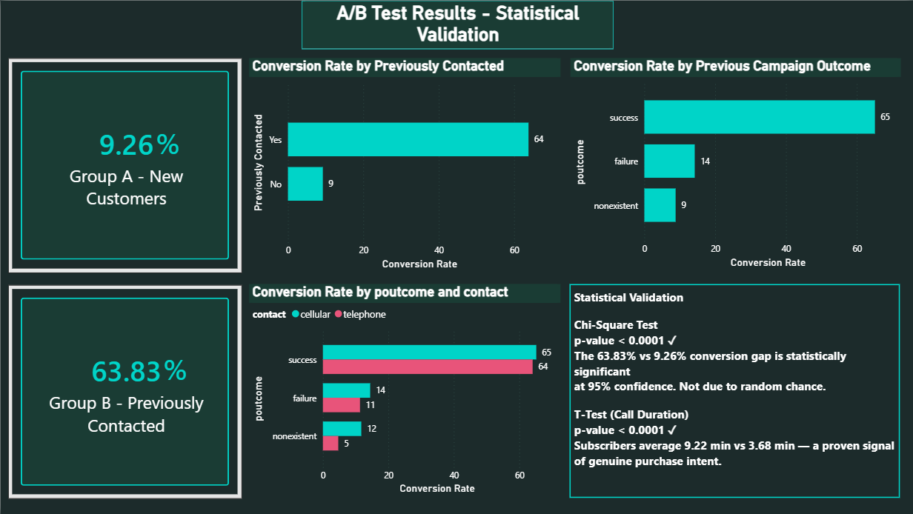

# 🏦 Bank Marketing Campaign Analysis
### ROI Analysis, Customer Segmentation & A/B Testing | SQL · Python · Power BI


---

## 📌 Project Overview

A Portuguese retail bank conducted a series of direct marketing campaigns
to promote term deposit subscriptions among its existing customers.
Despite 41,176 customer interactions, the overall subscription rate stood
at just **11.27%** — indicating significant inefficiency in targeting,
channel allocation, and campaign timing.

This project performs an end-to-end analysis of campaign performance data
to identify what worked, what didn't, and where the bank should focus its
marketing budget in future campaign cycles.

> **Headline Finding:** Previously contacted customers convert at **63.83%**
> — 6.9x higher than new customers at 9.26%. This difference is
> statistically proven (p < 0.0001) and forms the core budget
> recommendation of this project.

---

## 🎯 Business Questions

| # | Question | Type |
|---|---|---|
| Q1 | What is the overall conversion rate and which time periods perform best? | Descriptive |
| Q2 | Which contact channel delivers higher ROI — cellular or telephone? | Diagnostic |
| Q3 | Which customer segments show the highest propensity to subscribe? | Diagnostic |
| Q4 | Is the conversion gap between previously contacted and new customers statistically significant? | Inferential |
| Q5 | How should the bank reallocate its marketing budget to maximise conversions? | Prescriptive |

---

## 📊 Dashboard Preview

### Page 1 — Executive Overview


### Page 2 — Channel & Timing Analysis


### Page 3 — Customer Segments Analysis


### Page 4 — A/B Test Results


---

## 🔍 Key Findings

### Q1 — Timing
- **March** has the highest conversion rate at **51%** — 4.5x the annual average
- **September, October and December** also outperform at 44–49%
- **Thursday** is the best day to contact customers (12.1% conversion)
- Conversion rate is inversely correlated with the Euribor interest rate

### Q2 — Channel
- **Cellular** converts at **14.74%** vs telephone at **5.23%** — nearly 3x higher
- Subscribers average **9.22 minutes** on calls vs 3.68 minutes for non-subscribers
- Longer call duration is a statistically proven signal of purchase intent (p < 0.0001)

### Q3 — Customer Segments
- **Students** (31%) and **retired customers** (25%) are the top performing job segments
- **60+ age group** converts at **46%** — 4x the overall average
- **University degree** holders and **illiterate** customers outperform the average
- Best single combination: Cellular + March + Student + 18–30 = **66.67%** conversion

### Q4 — A/B Test Results
| Test | Result | p-value |
|---|---|---|
| Chi-square (conversion rate gap) | ✅ Statistically Significant | < 0.0001 |
| T-test (call duration gap) | ✅ Statistically Significant | < 0.0001 |

The 63.83% vs 9.26% conversion gap between previously and newly contacted
customers is **not due to random chance** — it is a real, actionable pattern.

### Q5 — Budget Recommendations
1. **Prioritise previously contacted customers** — allocate 60% of outreach budget here first
2. **Use cellular exclusively** — reallocate all telephone budget to cellular
3. **Cap contacts at 2 per customer** — conversion drops below average from contact 3 onwards
4. **Schedule campaigns in March, September, and October**
5. **Target students and retired customers** as priority segments

> Projected impact: Focusing budget on the optimal combination (cellular +
> previously contacted + March) could realistically achieve **50–65%**
> conversion vs the current **11.27%** average.

---

## 🗂️ Project Structure

```
bank-marketing-analysis/
├── data/
│   ├── bank_marketing.xlsx               ← Raw dataset
│   └── bank_marketing_cleaned.csv        ← Cleaned dataset for SQL import
├── notebooks/
│   ├── 01_data_cleaning_eda.ipynb        ← Data cleaning, feature engineering & EDA
│   └── 03_ab_testing.ipynb               ← A/B testing & statistical validation
├── sql/
│   └── queries.sql                       ← 15+ annotated business queries
├── reports/
│   ├── business_problem.md               ← Business problem document
│   ├── chart1_2_timing_analysis.png      ← EDA charts
│   ├── chart3_4_channel_analysis.png
│   ├── chart5_6_segment_analysis.png
│   ├── chart7_previous_campaign.png
│   ├── chart8_economic_context.png
│   ├── ab_test_results.png
│   ├── page1_executive_overview.png      ← Dashboard screenshots
│   ├── page2_channel_timing.png
│   ├── page3_customer_segments.png
│   ├── page4_ab_test_results.png
│   └── bank_marketing_dashboard.pdf      ← Full dashboard export
├── dashboard/
│   └── bank_marketing_dashboard.pbix     ← Power BI file
└── README.md
```

---

## 🛠️ Tech Stack

| Tool | Purpose |
|---|---|
| **Python** (Pandas, Seaborn, Matplotlib) | Data cleaning, feature engineering, EDA |
| **SciPy** | Chi-square test, two-sample t-test, statistical validation |
| **MySQL** | Business queries, segmentation, campaign analysis |
| **Power BI** | 4-page interactive dashboard, DAX measures |
| **SQLAlchemy** | Python → MySQL data pipeline |

---

## 📁 Dataset

- **Source:** UCI Machine Learning Repository — Bank Marketing Dataset
- **Size:** 41,176 rows × 21 columns (after cleaning)
- **Period:** March to December (multi-year campaign data)
- **Target variable:** `y` — Did the customer subscribe to a term deposit? (yes/no)
- **Overall conversion rate:** 11.27%

---

## ▶️ How to Run

**1. Clone the repository**
```bash
git clone https://github.com/[your-username]/bank-marketing-analysis.git
cd bank-marketing-analysis
```

**2. Install dependencies**
```bash
pip install pandas numpy matplotlib seaborn scipy sqlalchemy openpyxl
```

**3. Run the notebooks**
```
Open notebooks/01_data_cleaning_eda.ipynb in VS Code
Run all cells top to bottom
Then open notebooks/03_ab_testing.ipynb and run all cells
```

**4. Set up the SQL database**
```bash
mysql -u root -p --local-infile=1
```
```sql
CREATE DATABASE bank_marketing;
USE bank_marketing;
-- Then run the table creation and LOAD DATA commands in sql/queries.sql
```

**5. Open the dashboard**
```
Open dashboard/bank_marketing_dashboard.pbix in Power BI Desktop
```

---

## 👤 Author

**Vinup Ram S A**
Risk Consulting Specialist → Aspiring Data Analyst
📍 Bengaluru, India

[](https://www.linkedin.com/in/vinup-ram-16b96128b/)
[](https://github.com/vinup-ram1308)

---

*This project was completed as part of a data analytics portfolio to demonstrate
end-to-end analytical capability across Python, SQL, statistical testing, and
business intelligence dashboarding.*
